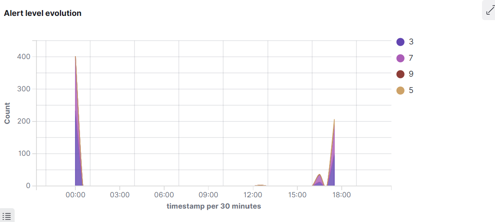
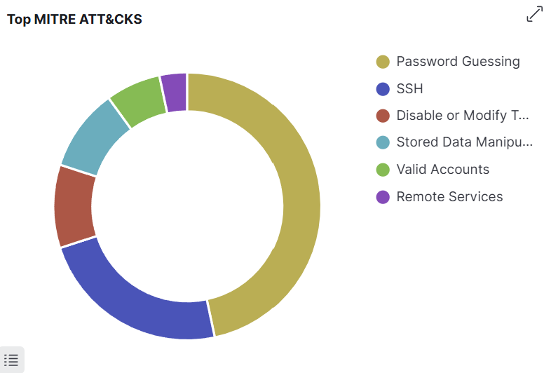

# Scenario 1: SSH brute-force followed by successful login

A common opening move on an externally exposed Linux host. An attacker sprays a wordlist against the SSH service, lands on a reused or weak password, and gets a shell. This walkthrough shows the lab catching both halves of that move.

## Threat model

| Element | Detail |
|---|---|
| Initial access | T1110.001 - Brute Force: Password Guessing |
| Resulting access | T1078 - Valid Accounts |
| Asset | `ubuntu.target` (a stand-in for any internet-exposed Linux host) |
| Detection origin | Wazuh agent reads `/var/log/auth.log`, manager evaluates rules |
| Custom rules | `100100` (brute-force burst), `100101` (brute-force then success) |

## How to run it

Prerequisites: the lab is up (`./scripts/setup/bootstrap.sh`) and `sshpass` is installed.

```bash
./scripts/attacks/01-ssh-bruteforce.sh
```

The script tries eight passwords against `labuser@127.0.0.1:2222`. The last password (`Password1`) is the real one, so the final attempt succeeds.

## What you should see in the dashboard

Open the Wazuh dashboard, go to **Modules -> Security events**, and filter on `agent.name:ubuntu.target`. Alerts appear within roughly ten seconds.

| Order | Rule ID | Level | What it means |
|---|---|---|---|
| 1-7 | 5710 | 5 | sshd: authentication failed (one alert per failed attempt) |
| 8 | 100100 | 10 | home-soc-lab: SSH brute-force - 6+ failures from same source in 60s |
| 9 | 5715 | 3 | sshd: authentication success |
| 10 | 100101 | 12 | home-soc-lab: SSH brute-force followed by successful login - probable compromise |

The level-12 alert is the one a SOC analyst would chase. Levels 5 and 3 are noise on their own and only become useful in correlation.

The alert timeline shows the burst clearly — a sharp spike of level-5 and level-7 events over a few seconds, exactly the pattern a fast scripted attack produces.



The MITRE ATT&CK breakdown confirms the technique mapping is wired up correctly: Password Guessing (T1110.001) dominates, with SSH (T1021.004) as the access vector.



## Why the rules are written this way

Built-in rule 5710 fires on every failed SSH attempt. On a real internet-facing host that is constant noise: bots scan port 22 around the clock and authentication failures number in the thousands per day. Alerting on 5710 individually would drown an analyst in false positives.

The custom rule 100100 layers on top with `frequency=6` and `timeframe=60`. That means six failures from the same source IP within sixty seconds before the rule fires. The threshold is deliberately tight enough to catch hands-on or scripted attacks while ignoring slow scanners.

Rule 100101 is the escalation. It only fires when 100100 has already fired *and* a successful login (rule 5715) follows from the same source within two minutes. This is the strongest signal you can build with auth logs alone: it says "an attacker who was guessing passwords just got in".

## What this would change in a real estate

In a school's IT environment you would extend this in two directions:

1. **Active response.** Wazuh can run a script when a rule above a chosen level fires. A `firewall-drop` active response would block the offending IP at the host firewall the moment 100100 hits, well before 100101 needs to fire. The roadmap entry in the README points at that.
2. **Source enrichment.** Add a custom decoder that tags whether the source IP is on the staff VLAN, the BYOD VLAN, or external. A brute-force from a staff machine is a far more concerning event than the same pattern from the public internet, and the alert priority should reflect that.

## Lessons learned

The first version of rule 100100 used a 300-second window and a frequency of 10. It worked but felt sluggish: by the time the alert fired, an attacker with a fast wordlist would already be in. Tightening to 60 seconds and 6 attempts gave a much better feel without noticeably increasing false positives in the lab. There is a tuning lesson in that: the right thresholds come from running the detection against realistic traffic, not from picking sensible-looking numbers.

Pairing 100100 with 100101 is also a useful pattern beyond brute-force. The same shape (suspicious activity followed by a success indicator) shows up in privilege-escalation chains, lateral-movement chains, and exfiltration. It is worth building the muscle now.
